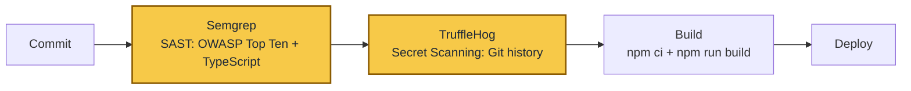

# Ford Vision - Sprint 3 de Cybersecurity

Projeto acadêmico da FIAP sobre uma plataforma web para o cenário Ford. O escopo desta Sprint é web e API com Next.js App Router e PostgreSQL. Não há componente IoT, aplicativo mobile ou modelo de machine learning neste repositório. Esses itens são N/A porque não fazem parte da arquitetura entregue, e não foram simulados apenas para preencher a documentação.

Este projeto não é um produto oficial da Ford Motor Company. Marcas e logotipos são usados apenas para fins educacionais.

## Visão geral do sistema

A aplicação usa TypeScript, Next.js 16, PostgreSQL, Zod, jose e bcryptjs. As rotas de negócio ficam em `app/api`, enquanto os controles de autenticação, sessão, autorização, armazenamento seguro, auditoria e política ficam em `lib/server`. Os perfis usados no sistema são `usuario` (cliente), `analista` e `admin`.

As principais telas são `/`, `/app`, `/command`, `/motor`, `/sessions`, `/admin`, `/admin/audit` e `/reset`. A API cobre autenticação e sessões, leads, veículos, manutenção, usuários administrativos, políticas de segurança e auditoria.

## Etapa 1: Pipeline DevSecOps e análise de código

Foi criado o workflow `.github/workflows/devsecops.yml`. Ele é disparado em `push` e `pull_request`, tem permissão somente de leitura do conteúdo e possui dois jobs de segurança. O job de SAST executa Semgrep com `p/owasp-top-ten` e `p/typescript`, salva JSON/SARIF como artifact e depois executa `npm ci` e `npm run build`. O job de secret scanning faz checkout com histórico completo, executa `trufflesecurity/trufflehog` contra o repositório e publica o relatório JSON como artifact.

O desenho do fluxo está em `docs/sprint3/etapa1-pipeline.mmd` e também pode ser visto abaixo. Os dois blocos amarelos são as barreiras de segurança antes do build e do deploy.



Na máquina usada para preparar a entrega, os comandos `semgrep` e `trufflehog` não estavam instalados. Isso foi registrado sem transformar a ausência da ferramenta em um falso resultado positivo. Os arquivos `docs/sprint3/etapa1-evidencias/semgrep-local.txt` e `docs/sprint3/etapa1-evidencias/trufflehog-local.txt` guardam os comandos tentados, a saída real e a revisão manual complementar. A análise local verificou que as rotas passam por schemas Zod, que os acessos SQL usam parâmetros e que não há uso identificado de execução de processos ou `dangerouslySetInnerHTML`.

### Pesquisa orientada: SCA e segurança de containers

SCA (Software Composition Analysis) verifica as dependências do projeto e compara versões com bancos de vulnerabilidades. Neste caso, Dependabot poderia abrir pull requests a partir do `package.json` e `package-lock.json`, enquanto Snyk poderia entrar como um job depois de `npm ci`, falhando o pipeline quando uma vulnerabilidade acima do nível definido fosse encontrada. Após a atualização de Next.js, Nodemailer, nanoid, PostCSS e dependências transitivas, `npm audit` terminou com zero vulnerabilidades nesta instalação. O `npm audit` continua sendo um controle complementar, não substituto da análise de contexto feita em uma ferramenta de SCA.

Container Security entraria depois do build da imagem Docker e antes do deploy. Uma ferramenta como Trivy verificaria pacotes do sistema na imagem `node:20-bookworm-slim`, dependências Node e configurações perigosas, como usuário root ou portas desnecessárias. Não foi implementada nesta Sprint porque o pipeline atual ainda não publica uma imagem em registry. O Dockerfile hardened preparado na Etapa 2 deixa esse próximo passo bem definido.

## Etapa 2: Segurança em código e infraestrutura

### Dados em repouso

Em `lib/server/crypto.ts`, os dados são serializados e protegidos com AES-256-GCM. A chave é derivada por SHA-256 a partir de `DATA_ENCRYPTION_KEY`, o IV é aleatório de 12 bytes e o auth tag é armazenado junto do ciphertext:

```ts
const key = crypto.createHash("sha256").update(config.dataEncryptionKey).digest();
const iv = crypto.randomBytes(12);
const cipher = crypto.createCipheriv("aes-256-gcm", key, iv);
const encrypted = Buffer.concat([cipher.update(plain), cipher.final()]);
const tag = cipher.getAuthTag();
```

`lib/server/secureStore.ts` usa esse formato para persistir dados no PostgreSQL, na tabela `secure_store`, quando `DATABASE_URL` existe. Em desenvolvimento há fallback para `data/secure/*.enc`, também cifrado. Em produção na Vercel o código exige um backend persistente. A função `secureDeleteFile` sobrescreve o arquivo com bytes aleatórios e zeros antes de removê-lo. Tokens que precisam ser comparados, como refresh tokens e tokens de reset, são guardados como hash SHA-256, não em texto puro.

### Hardening da API

`lib/server/rateLimit.ts` limita autenticação a 10 requisições por minuto, API geral a 120 e operações pesadas a 30. Quando o limite é excedido, o tempo de bloqueio cresce até 15 minutos. `lib/server/loginGuard.ts` bloqueia uma identidade após 5 falhas dentro de 10 minutos, por 15 minutos. A rota de login registra `auth_login_failed`, `auth_locked` e `auth_rate_limited`.

Em `lib/server/validators.ts`, a entrada é validada com Zod. Há limites de tamanho, regex para username e VIN, senha forte com 12 caracteres, tipo enumerado para papéis e rejeição de texto com padrões de comando. Antes do schema, `lib/server/body.ts` restringe JSON, tamanho a 32 KB, profundidade a 20 níveis e quantidade de nós a 2.000. Um exemplo real é:

```ts
export const userRoleUpdateSchema = z.object({
	role: z.enum(["usuario", "analista", "admin"]),
});
```

`lib/server/auth.ts` usa bcrypt para a senha e JWT HS256 com issuer, audience, subject, identificador da sessão e expiração. O access token dura 15 minutos. O refresh token é rotacionado e seu hash é conferido na sessão persistida. Os cookies são HTTP-only, SameSite strict e o refresh cookie fica limitado ao caminho `/api/auth/refresh`.

### RBAC

`lib/server/authorize.ts` centraliza o controle com `requireRole`. Primeiro verifica o cookie, depois a assinatura JWT, a existência da sessão ativa e, por fim, a hierarquia `usuario < analista < admin`. As rotas fazem a checagem no servidor. Por exemplo, `GET /api/leads` exige `admin`, enquanto criação de lead e veículo exige `analista`. Rotas de usuários, políticas, retenção e auditoria exigem `admin`. A alteração de papel também impede que o administrador altere o próprio papel ou remova o último administrador, em `app/api/admin/users/[id]/role/route.ts`.

### Dockerfile hardened

O `Dockerfile` da raiz usa três estágios: dependências, build e runtime. A imagem final usa `node:20-bookworm-slim`, não carrega ferramentas de build, executa o bundle standalone do Next e roda com o usuário não-root `nextjs` (UID 1001). O `output: "standalone"` correspondente foi habilitado em `next.config.js`. Segredos, conexão PostgreSQL e configuração de produção continuam sendo fornecidos por variáveis de ambiente, não pela imagem.

Commits relevantes do histórico são `7056c4e` (`feat(security): complete cybersecurity hardening and quality cleanup`), `2bc0331` (`chore(security): apply npm audit dependency fixes`), `a7960ca` (`chore(security): tighten tls migration and origin validation`), `0f72f5c` (`fix(auth): prevent logout on same-origin requests without origin`) e `f9d16f7` (`chore: align .env.example keys with production`).

## Etapa 3: Logs, alertas e resposta a incidentes

`lib/server/logger.ts` monta eventos estruturados com `id`, `type`, `requestId`, `actorId`, `actorRole`, `ip`, `createdAt` e `details`. Os detalhes passam por limite de profundidade, quantidade de chaves, tamanho de strings e redaction de nomes como `password`, `token`, `secret`, `cookie`, `session`, `email`, `phone` e `vin`. O evento é emitido em JSON no console e também persistido no store de auditoria cifrado, com no máximo 10.000 eventos.

Um exemplo real de linha produzida pelo logger, com valores ilustrativos apenas nos campos variáveis, é:

```json
{"level":"info","timestamp":"2026-09-23T12:00:00.000Z","id":"abc123","type":"auth_login_success","actorId":"user-1","actorRole":"analista","requestId":"req-1","ip":"203.0.113.10","createdAt":"2026-09-23T12:00:00.000Z"}
```

O login gera eventos de sucesso, falha, bloqueio e erro. Alterações de papel geram `user_role_changed`, criação de lead e veículo gera eventos de negócio, e consultas acima do limite geram `massive_query`. Erros de persistência, leitura e corrupção do store são registrados com severidade de erro sem expor o conteúdo sensível.

Foi implementada uma regra simples no próprio logger: tipos que terminam em `_rate_limited` ou que contêm `locked` recebem severidade `alert`; tipos com `error` recebem `error`; os demais recebem `info`. Assim, o bloqueio após 5 falhas ou abuso de uma API não fica apenas como evento informativo. Em operação, a saída `level=alert` pode alimentar um alerta do provedor de logs. O controle ainda é local ao processo, portanto um próximo passo seria exportar os eventos para um SIEM.

### Fluxo SANS PICERL

**Preparação.** As regras de rate limit, `loginGuard`, RBAC, CSRF, origem permitida, HTTPS, cookies protegidos e política de retenção ficam configuradas em `lib/server/config.ts` e nos módulos de `lib/server`.

**Identificação.** O time consulta `GET /api/audit`, observa logs JSON por `requestId`, IP e papel, e acompanha os gatilhos `auth_login_failed`, `auth_locked`, `*_rate_limited`, `payload_signature_invalid` e `massive_query`.

**Contenção.** O login é bloqueado pelo `loginGuard`, a API responde 429 pelo rate limit e sessões podem ser revogadas individualmente ou em massa por `/api/auth/logout` e `/api/auth/logout-all`. A autorização impede que um usuário comum faça a contenção administrativa.

**Erradicação.** O administrador pode alterar o papel comprometido, revogar sessões, invalidar tokens por rotação/revogação e executar a retenção de auditoria. Segredos suspeitos devem ser trocados no ambiente, fora do código-fonte.

**Recuperação.** O serviço é reconstruído pelo pipeline após as verificações, as migrações podem ser executadas com `npm run db:migrate`, e a saúde da aplicação é verificada com os testes, lint e build antes do deploy.

**Lições aprendidas não faz parte deste fluxo**, conforme o recorte definido para a Sprint.

## Etapa 4: Pesquisa de vulnerabilidades OWASP

### OWASP Top 10 (2021)

| Risco | Situação no projeto | Mitigação ou evidência |
|---|---|---|
| A01 Broken Access Control | Mitigado | RBAC server-side em `lib/server/authorize.ts`; rotas administrativas usam `requireRole`; `app/api/admin/users/[id]/role/route.ts` protege o último admin. |
| A02 Cryptographic Failures | Mitigado | AES-256-GCM em `lib/server/crypto.ts`, `secureStore.ts`, bcrypt em `lib/server/auth.ts`, cookies HTTP-only e TLS exigido em `lib/server/http.ts`. |
| A03 Injection | Mitigado | Zod em `lib/server/validators.ts` e `body.ts`; consultas PostgreSQL parametrizadas; não há execução de shell identificada na revisão manual. |
| A04 Insecure Design | Parcialmente mitigado | Limites, sessão, CSRF, assinatura de payload e auditoria existem. Não há MFA nem SIEM central, então o risco residual permanece. |
| A05 Security Misconfiguration | Parcialmente mitigado | Headers de segurança em `next.config.js`, secrets obrigatórios em produção e `.env` no `.gitignore`. CSP ainda usa `unsafe-inline` para compatibilidade. |
| A06 Vulnerable Components | Parcialmente mitigado | `package-lock.json` e commit `2bc0331` registram correções de dependências. SCA contínuo com Dependabot/Snyk ainda não foi habilitado. |
| A07 Identification and Authentication Failures | Mitigado | JWT com issuer/audience/expiração, bcrypt, loginGuard, rate limit, rotação e revogação em `auth.ts` e `sessions.ts`. MFA não existe. |
| A08 Software and Data Integrity Failures | Mitigado | Assinatura de payload em `lib/server/signature.ts`, CSRF, revisão por pull request com workflow e armazenamento autenticado por GCM. |
| A09 Security Logging and Monitoring Failures | Parcialmente mitigado | Logger estruturado, auditoria cifrada, alertas locais e `GET /api/audit`. Falta integração com monitoramento externo. |
| A10 SSRF | N/A no fluxo atual / risco residual | Não há endpoint público de URL arbitrária. A integração em `externalService.ts` usa URL de configuração; ainda deve manter allowlist e timeout em produção. |

### OWASP API Security Top 10

| Risco | Situação | Mitigação ou evidência nas rotas `app/api/*` |
|---|---|---|
| API1 BOLA | Mitigado | Sessões e IDs são conferidos no servidor; sessões individuais exigem o usuário dono em `app/api/auth/sessions/[id]/route.ts`. |
| API2 Broken Authentication | Mitigado | `auth/login`, `refresh`, cookies protegidos, JWT verificado e refresh token rotacionado. |
| API3 Broken Object Property Level Authorization | Mitigado | Schemas Zod limitam campos; respostas administrativas selecionam explicitamente campos públicos em `app/api/admin/users`. |
| API4 Unrestricted Resource Consumption | Mitigado | `rateLimit`, limite de body de 32 KB, limite de profundidade/nós e paginação máxima. |
| API5 Broken Function Level Authorization | Mitigado | `requireRole` é chamado nas rotas de leads, veículos, manutenção, auditoria e administração. |
| API6 Unrestricted Access to Sensitive Business Flows | Parcialmente mitigado | CSRF, origem, rate limit e assinatura protegem mutações. Não existe detecção distribuída de fraude entre instâncias. |
| API7 Server Side Request Forgery | N/A no endpoint público | Não há rota que aceite URL do cliente; chamadas externas partem de configuração do servidor e têm timeout. |
| API8 Security Misconfiguration | Parcialmente mitigado | CORS/origem, HTTPS, headers e erros seguros estão em `http.ts`; CSP possui `unsafe-inline` como ponto residual. |
| API9 Improper Inventory Management | Mitigado | Rotas são organizadas no App Router e o workflow testa build. Fica como manutenção futura versionar formalmente a API. |
| API10 Unsafe Consumption of APIs | Parcialmente mitigado | `externalService.ts` usa timeout e eventos assinados; validação de contrato e observabilidade do fornecedor ainda podem ser ampliadas. |

### OWASP Mobile Top 10

Todos os itens do OWASP Mobile Top 10 são **N/A** para esta entrega. Não existe aplicativo Android/iOS, SDK mobile, armazenamento local mobile, deep link ou API exclusiva de dispositivo. A superfície analisada é o navegador e as rotas web/API do Next.js. Por isso, os controles de sessão, origem, cookies e validação foram mapeados no OWASP Top 10 e no API Security Top 10, não em um cliente mobile inexistente.

### OWASP ASVS

Foi escolhido o **ASVS Level 1**, adequado ao escopo acadêmico e ao risco principal desta aplicação web. O nível não significa que os controles mais fortes sejam desnecessários; significa que este é o conjunto mínimo usado para organizar a verificação.

| Área ASVS | Requisito aplicável | Evidência | Status |
|---|---|---|---|
| V2 Authentication | Senhas devem ter política mínima e hash seguro | `validators.ts` exige 12 caracteres, maiúscula, minúscula, número e símbolo; `auth.ts` usa bcrypt. | Mitigado |
| V2 Authentication | Proteção contra ataques automatizados | `rateLimit.ts` e `loginGuard.ts`, usados em `auth/login`. | Mitigado |
| V3 Session Management | Tokens devem expirar e ser revogáveis | `auth.ts`, `sessions.ts`, cookies HTTP-only, access de 15 min e logout/revogação. | Mitigado |
| V3 Session Management | Separação de refresh token | Cookie com caminho `/api/auth/refresh`, rotação e hash persistido. | Mitigado |
| V4 Access Control | Autorização no servidor | `authorize.ts` e `requireRole` nas rotas de API. | Mitigado |
| V5 Validation | Validar tipo, tamanho e formato da entrada | `body.ts` e schemas de `validators.ts`. | Mitigado |
| V5 Validation | Rejeitar payloads excessivos ou complexos | 32 KB, 20 níveis e 2.000 nós em `body.ts`. | Mitigado |
| V7 Error Handling | Não vazar detalhes internos | `errors.ts`, `errorResponse` e mensagens seguras nas rotas. | Mitigado |
| V7 Error Handling | Registrar eventos de segurança | `logger.ts`, auditoria cifrada e `GET /api/audit`. | Parcialmente mitigado |

### Plano de mitigação dos pontos restantes

O próximo incremento deve adicionar Dependabot ou Snyk ao workflow e Trivy ao estágio de imagem. Em seguida, os eventos `alert` precisam ser enviados para um serviço central com retenção e notificação, porque o logger atual é confiável para auditoria local, mas não substitui monitoramento distribuído. Também recomendo remover gradualmente `unsafe-inline` da CSP com nonces, adicionar MFA para administradores, formalizar versionamento das rotas e criar testes de integração para verificar cada combinação de papel e endpoint.

## Execução local

Pré-requisito: Node.js 18 ou superior.

```bash
npm install
npm run dev
```

A aplicação usa `http://localhost:3001` no desenvolvimento. Os comandos de verificação são `npm run lint`, `npm run test`, `npm run build` e `npm run db:migrate`. Em produção, configure as variáveis de `.env.example`, `ALLOWED_ORIGINS`, `APP_BASE_URL`, `DATABASE_URL`, TLS, SMTP e mantenha `SEED_DEMO_USERS=false`.

Para avaliação local existem usuários de demonstração `admin`, `analista` e `cliente`, com senhas iguais aos respectivos nomes. Eles servem somente para homologação, não para produção.

## Integrantes

Bento Rangel - RM559124; Eric Yuji - RM554869; Higor Batista - RM558907; Kaue Pires - RM554403; Ricardo Di Tilia - RM555155.
